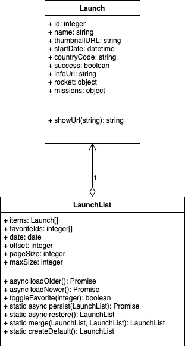
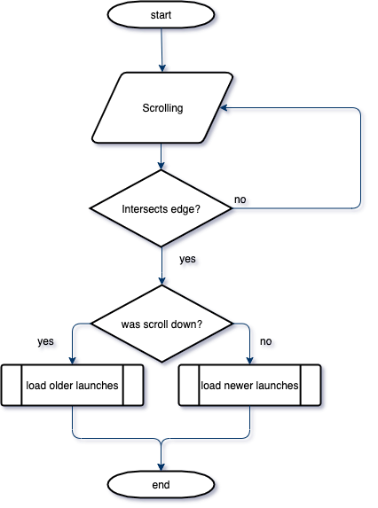
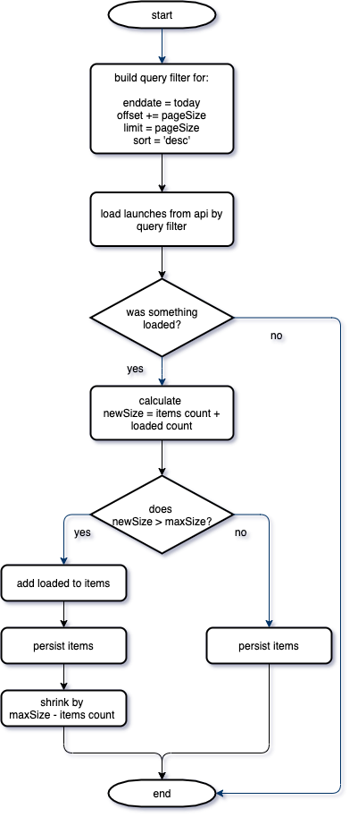

# The Rocket Launch App Home Challenge  <!-- omit in toc -->

This is my implementation of [Home challenge](Mobile%20Task%20-%20The%20Rocket%20Launch%20App%20Home%20Challenge.pdf). In [TODO](#todo) I wrote my tasks, which I resolved/planned to. Also here presented git private repo, which contain my development history. 

For fast start, install [nodejs](https://nodejs.or) and type in your CLI:
```
npm i && npm start
```

## Navigation  <!-- omit in toc -->
- [TODO](#todo)
- [Technical design](#technical-design)
  - [Domain](#domain)
  - [Scroll workflow](#scroll-workflow)
  - [Load next launches workflow](#load-next-launches-workflow)
- [Afterwords](#afterwords)
- [Generated docs](#generated-docs)
  - [Available Scripts](#available-scripts)
    - [`npm start`](#npm-start)
    - [`npm test`](#npm-test)
    - [`npm run build`](#npm-run-build)
    - [`npm run eject`](#npm-run-eject)
  - [Learn More](#learn-more)
    - [Code Splitting](#code-splitting)
    - [Analyzing the Bundle Size](#analyzing-the-bundle-size)
    - [Making a Progressive Web App](#making-a-progressive-web-app)
    - [Advanced Configuration](#advanced-configuration)
    - [Deployment](#deployment)
    - [`npm run build` fails to minify](#npm-run-build-fails-to-minify)

## TODO
- [x] Create app: [CRA](https://github.com/facebook/create-react-app).
- [x] Setup api proxy (to avoid CORS issues): [CRA proxy configuration](https://create-react-app.dev/docs/proxying-api-requests-in-development)
- [x] Techincal design: [Technical design](#technical-design)
- [ ] Client implementation:
  - [x] Tab 1 - launch list
  - [x] Tab 1 - launch details
  - [x] Tab 1 - launch filter
  - [x] Tab 2 - favorites
- [ ] Refactoring
- [ ] Further perfomance improvements
- [ ] Docs update
- [x] Afterwords: [Afterwords](#afterwords)

## Technical design

### Domain


### Scroll workflow


### Load next launches workflow

The main idea to not exceed some render limit, when we scroll for a long time.
Below I try to show some abstract infinity scrollable tape, which has limited render zone.
```
                           |     |  - empty
                        |---------- - load trigger zone
                        | || ... ||
                        | ||     || - render zone
            constant    | ||=====||
launches <= max size ---| ||/////|| - view zone
                        | ||=====||
                        | ||     || - render zone
                        | || ... ||
                        |---------- - load trigger zone
                           |     |  - empty
```
Here is flowchart of possible implementation:



## Afterwords
Thanks for reading until here :). 
h
For me, the main goal in this challenge, was to demonstrate how I develops some kind of application. Most technologies/libs/frameworks presented here I used previously. Exceptions are React hooks and emojis 😆.

There are also more things to do:
* some bugs of course ("jerky" scrolling; scroll in top direction?; specific ui of course :)) 
* todos (for such project global store are more prefable; more tests, including ui)
* perfomance improvements (more accurate estimation of render zone; aggressive caching with save in local storage more items)
And I think, that I can solve, but with more time. But I believe that the main goal at this stage I have achieved.

In conclusion, there was a nice challenge for me, and thank you for reviewing!

---
## Generated docs

This project was bootstrapped with [Create React App](https://github.com/facebook/create-react-app).

### Available Scripts

In the project directory, you can run:

#### `npm start`

Runs the app in the development mode.<br />
Open [http://localhost:3000](http://localhost:3000) to view it in the browser.

The page will reload if you make edits.<br />
You will also see any lint errors in the console.

#### `npm test`

Launches the test runner in the interactive watch mode.<br />
See the section about [running tests](https://facebook.github.io/create-react-app/docs/running-tests) for more information.

#### `npm run build`

Builds the app for production to the `build` folder.<br />
It correctly bundles React in production mode and optimizes the build for the best performance.

The build is minified and the filenames include the hashes.<br />
Your app is ready to be deployed!

See the section about [deployment](https://facebook.github.io/create-react-app/docs/deployment) for more information.

#### `npm run eject`

**Note: this is a one-way operation. Once you `eject`, you can’t go back!**

If you aren’t satisfied with the build tool and configuration choices, you can `eject` at any time. This command will remove the single build dependency from your project.

Instead, it will copy all the configuration files and the transitive dependencies (webpack, Babel, ESLint, etc) right into your project so you have full control over them. All of the commands except `eject` will still work, but they will point to the copied scripts so you can tweak them. At this point you’re on your own.

You don’t have to ever use `eject`. The curated feature set is suitable for small and middle deployments, and you shouldn’t feel obligated to use this feature. However we understand that this tool wouldn’t be useful if you couldn’t customize it when you are ready for it.

### Learn More

You can learn more in the [Create React App documentation](https://facebook.github.io/create-react-app/docs/getting-started).

To learn React, check out the [React documentation](https://reactjs.org/).

#### Code Splitting

This section has moved here: https://facebook.github.io/create-react-app/docs/code-splitting

#### Analyzing the Bundle Size

This section has moved here: https://facebook.github.io/create-react-app/docs/analyzing-the-bundle-size

#### Making a Progressive Web App

This section has moved here: https://facebook.github.io/create-react-app/docs/making-a-progressive-web-app

#### Advanced Configuration

This section has moved here: https://facebook.github.io/create-react-app/docs/advanced-configuration

#### Deployment

This section has moved here: https://facebook.github.io/create-react-app/docs/deployment

#### `npm run build` fails to minify

This section has moved here: https://facebook.github.io/create-react-app/docs/troubleshooting#npm-run-build-fails-to-minify
